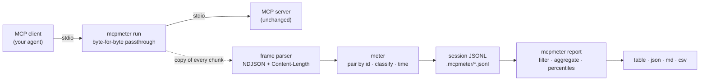

# mcpmeter

[English](README.md) | [中文](README.zh.md) | [日本語](README.ja.md)

[](LICENSE)  [](CHANGELOG.md)  [](CONTRIBUTING.md)

**MCP のための使用量メーター —— ツールごとのレイテンシ・ペイロードサイズ・エラー率を記録するパススルー stdio プロキシ。セッション全体を集計して分析レポートに変える。ランタイム依存ゼロ。**


```bash
# not yet on npm — install from a checkout of this repository
npm install && npm run build && npm pack
npm install -g ./mcpmeter-0.1.0.tgz
```

## なぜ mcpmeter？

エージェントが遅い。なのに、どの MCP ツールが原因なのか誰も言えない。クライアントはスピナーを回すだけ、サーバーのログには何も残らず、stdio 上の JSON-RPC の会話は見えないまま。既存の観測手段が答えるのは別の問いだ。フレーム整形プリンタが見せるのは*流れていく 1 セッション*——壊れたハンドシェイクのデバッグには最適でも、「今週レイテンシ予算を食い潰したツールはどれか」には答えられない。ゲートウェイは頼んでいないポリシーや認証まで持ち込むし、APM スタックはサーバー内に SDK を要求する——そのコードは大抵編集できないのに。mcpmeter はその中間にある地味な計器だ。クライアント設定のサーバーコマンドに一語を前置するだけで、各セッションがメタデータのみの JSONL ファイルとして静かに蓄積される——メソッド名、ツール名、単調クロック上のレイテンシ、ワイヤ上のバイト数、結果分類。ペイロードは決して書かない。あとは `mcpmeter report` が任意の数のセッションをツール別のパーセンタイル・エラー率・トラフィック合計へ畳み込み、時間・ラベル・ツールで絞り込める。デバッガでもゲートウェイでもない。1 バイトも書き換えず、返す答えはスクロールではなく一枚の表だ。

| | mcpmeter | フレーム整形プリンタ | MCP ゲートウェイ | APM / トレーシング SDK |
|---|---|---|---|---|
| 中核となる出力 | セッション横断のツール別集計 | 1 フレームずつリアルタイム表示 | 監査 / ポリシーログ | バックエンド上のトレース |
| 「どのツールが遅い/多弁/失敗?」に答える | はい —— ツール別 p50/p90/p99・バイト数・エラー率 | スクロールバックを読むしかない | いいえ —— 目的が違う | 計装すれば可能 |
| 導入 | サーバーコマンドに `mcpmeter run --` を前置 | コマンドを 1 つ前置 | サービスを配備しクライアントを迂回 | サーバーコードを編集 |
| ワイヤ忠実度 | バイト単位のパススルー、読み取り専用 | おおむねパススルー | リクエストを終端し再発行 | 該当なし |
| リクエスト/レスポンス本文の保存 | 決してしない —— 設計上メタデータのみ | 表示してしまう | 監査ログに残ることが多い | 設定次第 |
| オフライン動作 / インフラ不要 | はい —— ディスク上の JSONL | はい | ゲートウェイの常駐が必要 | コレクタ/バックエンドが必要 |
| ランタイム依存 | 0（Node.js のみ） | まちまち | サービス 1 つ | SDK + エージェント |

<sub>比較は各カテゴリの 2026-07 時点の公開ドキュメントに基づく。RBAC やペイロード監査が必要ならゲートウェイをどうぞ —— mcpmeter は測るだけで、取り締まりはしない。</sub>

## 特徴

- **構造的に不可視** —— stdin・stdout・stderr・終了コードはバイト単位で素通し。計測は各チャンクの*コピー*に対して行うため、パース爆弾や巨大フレームが実トラフィックを改変・遅延・並べ替えることは決してない。
- **フレームダンプではなくツール別分析** —— `mcpmeter report` は記録済みセッションを、呼び出し数、エラー率（`isError` と JSON-RPC error を区別して計上）、最近接順位法の p50/p90/p99/max レイテンシ、ツール別・メソッド別の平均/最大/合計ワイヤバイト数へ集計する。
- **セッション全体を記帳** —— 通知、プロトコルストリーム上のジャンクバイト、キャンセルされた呼び出し、応答のない要求、宛先のない応答、id の重複まですべて数える。だからレポートは「遅いか」だけでなく「このサーバーは*間違っているか*」にも答える。
- **セッション横断のワークフロー** —— `--label v0.4.2` で実行にタグを付け、ラベル・時間窓・直近 N セッション・単一ツールでレポートを絞り込む。素のファイルだけでカナリアと昨日のベースラインを並べて比較できる。
- **4 つの出力形式** —— 桁揃えの端末テーブル、スクリプト向け JSON、PR 説明に貼れる Markdown、表計算向け CSV。同じ入力からはバイト単位で同一の出力が出る。
- **メタデータのみ、完全オフライン** —— 引数と結果はディスクに書かない。セッションは grep できるローカル JSONL。ソケットは一切開かず、テレメトリは存在せず、devDependency は `typescript` ただ一つ。

## クイックスタート

同梱のデモサーバー（速いツール・遅いツール・不安定なツールを持つドキュメントアシスタント）を計測してセッションを記録する：

```bash
mcpmeter run --dir .mcpmeter --session-id demo --label demo -- node examples/demo-server.mjs \
  < examples/requests.ndjson > /dev/null
```

```text
mcpmeter: 9 calls · 1 error · 0 unanswered · 3 tools · sent 977 B · received 54.5 KiB · 149ms
mcpmeter: session "demo" → .mcpmeter/demo.jsonl (view: mcpmeter report --dir .mcpmeter)
```

次に `examples/` に同梱の記録済みセッション 2 本を集計する —— 実際にキャプチャした実行結果：

```bash
mcpmeter report --dir examples/sample-sessions
```

```text
2 sessions · 2026-07-08T09:12:03.000Z → 2026-07-09T02:00:00.000Z
calls 116 · errors 4 (3.4%) · sent 44.4 KiB · received 1.5 MiB
unanswered 1 · junk 1 frame (27 B)

TOOL           CALLS  ERR   ERR%    P50    P90    P99    MAX   REQ~     RESP~      TOTAL
search_docs       51    0   0.0%   53ms   68ms   81ms   81ms  379 B  16.3 KiB  848.8 KiB
fetch_page        23    3  13.0%  332ms  933ms  966ms  966ms  212 B  31.6 KiB  732.4 KiB
summarize         21    1   4.8%   95ms  144ms  153ms  153ms  857 B     342 B   24.6 KiB
convert_units     17    0   0.0%    7ms   11ms   11ms   11ms  159 B     132 B    4.8 KiB

METHOD      CALLS  ERR  ERR%  P50  P90  P99  MAX  REQ~  RESP~    TOTAL
initialize      2    0  0.0%  6ms  6ms  6ms  6ms  89 B  310 B    798 B
tools/list      2    0  0.0%  3ms  3ms  3ms  3ms  47 B  640 B  1.3 KiB
```

遅くて、多弁で、失敗しがちなのは `fetch_page` —— コマンド一発で判明。

## クライアントへの接続

MCP クライアントの設定でサーバーコマンドを一枚包むだけ。それ以外は双方とも何も変わらない：

```json
{
  "mcpServers": {
    "docs": {
      "command": "mcpmeter",
      "args": ["run", "--dir", "/home/dev/.mcpmeter", "--label", "docs-v2", "--",
               "node", "/srv/docs-server/index.js"]
    }
  }
}
```

クライアントが開く会話の一つひとつがセッションファイルになる。mcpmeter は実環境で見られる 2 つの stdio フレーミング（MCP 仕様の改行区切り JSON と、LSP 風の `Content-Length` ヘッダ）をメッセージ単位で自動判別する。0.1.0 では HTTP トランスポートは計測対象外で、すべての MCP クライアントとの結合テストも未了 —— 検証済みの経路はリファレンス SDK の stdio。

## mcpmeter CLI

| コマンド | 動作 | 終了コード |
|---|---|---|
| `run [opts] -- <cmd...>` | サーバーを起動し stdio を素通しし、セッションを記録（`--dir`・`--session-id`・`--label`・`--max-frame`・`--quiet`） | サーバー自身の終了コード；127 起動失敗；2 使い方の誤り |
| `report [opts]` | セッションを集計（`--format table\|json\|md\|csv`・`--sort`・`--top`・`--last`・`--since`・`--label`・`--tool`） | 0；1 セッションなし；2 使い方の誤り |
| `sessions [opts]` | 記録済みセッションを件数付きで一覧（`--dir`・`--format table\|json`） | 0；1 セッションなし；2 使い方の誤り |

## レポートの読み方

| 列 | 意味 |
|---|---|
| `CALLS` / `ERR` / `ERR%` | 完了した要求/応答ペア。エラー = `tool_error`（`result.isError`）+ `rpc_error`（JSON-RPC `error`）。キャンセルは別枠で数え、エラー扱いしない |
| `P50` `P90` `P99` `MAX` | 単調クロック上の最近接順位パーセンタイル —— 報告される値はすべて実際に起きたレイテンシであり、補間は決してしない |
| `REQ~` / `RESP~` / `TOTAL` | 平均リクエスト / 平均レスポンス / 合計ワイヤバイト数（フレーミング込み） |
| `unanswered` | セッション終了時点で未応答のままだった要求 —— 「帰ってこなかったツール」 |
| `junk` | プロトコルストリーム上の JSON-RPC でないバイト（漏れ出た `print`、巨大フレーム）—— そのまま通しつつ、記帳する |

セッションファイルのレイアウト（イベント 1 件につき JSONL 1 行、メタデータのみ）は [docs/session-format.md](docs/session-format.md) に、同梱サンプルの説明は [examples/](examples/README.md) にある。

## アーキテクチャ



## ロードマップ

- [x] 二重フレーミング対応のパススルー stdio プロキシ、MCP を理解する計測（ツールエラー・キャンセル・未応答・プロトコル異常）、JSONL セッションストア、フィルタとソート付き 4 形式のセッション横断レポート、91 件のオフラインテスト + スモークスクリプト（v0.1.0）
- [ ] 同じセッション形式のまま Streamable-HTTP トランスポートを計測
- [ ] `report --diff <labelA> <labelB>` で 2 つのサーバーバージョンを並べて A/B 比較
- [ ] CI 向けの予算ゲート：`report --fail-if "p99>500ms" --fail-if "err%>2"`
- [ ] `mcpmeter top` —— 現在のセッションを見るライブ更新の端末ビュー
- [ ] 既存ダッシュボードから収集できるヒストグラム出力（OpenMetrics テキスト、オプトイン）

完全なリストは [open issues](https://github.com/JaydenCJ/mcpmeter/issues) を参照。

## コントリビュート

コントリビュート歓迎。`npm install && npm run build` でビルドし、`npm test` と `bash scripts/smoke.sh`（`SMOKE OK` が出ること）を実行 —— このリポジトリは CI を一切持たず、上記の主張はすべてローカル実行で検証している。[CONTRIBUTING.md](CONTRIBUTING.md) を読み、[good first issue](https://github.com/JaydenCJ/mcpmeter/issues?q=is%3Aissue+is%3Aopen+label%3A%22good+first+issue%22) を拾うか、[discussion](https://github.com/JaydenCJ/mcpmeter/discussions) を始めてほしい。

## ライセンス

[MIT](LICENSE)
