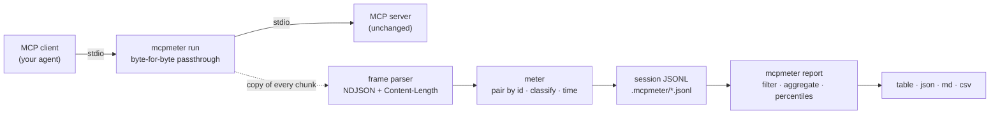

# mcpmeter

[English](README.md) | [中文](README.zh.md) | [日本語](README.ja.md)

[](LICENSE)  [](CHANGELOG.md)  [](CONTRIBUTING.md)

**Usage meter for MCP — a passthrough stdio proxy that records per-tool latency, payload sizes and error rates, then aggregates whole sessions into analytics reports. Zero runtime dependencies.**


```bash
# not yet on npm — install from a checkout of this repository
npm install && npm run build && npm pack
npm install -g ./mcpmeter-0.1.0.tgz
```

## Why mcpmeter?

Your agent feels slow and nobody can say which MCP tool is to blame. The client shows a spinner, the server's logs show nothing, and the JSON-RPC conversation on stdio is invisible. The existing lenses answer different questions: frame pretty-printers show you *one session scrolling by* — great for debugging a broken handshake, useless for "which tool eats our latency budget this week"; gateways add policy and auth you didn't ask for; APM stacks want an SDK inside the server, which you often cannot edit. mcpmeter is the boring instrument in the middle: prepend one word to the server command in your client's config, and every session quietly accumulates as a metadata-only JSONL file — method, tool name, latency on a monotonic clock, wire bytes, outcome; never your payloads. Then `mcpmeter report` folds any number of sessions into per-tool percentiles, error rates and traffic totals, filterable by time, label or tool. It is not a debugger and not a gateway: it never rewrites a byte, and the answer it produces is a table, not a scroll.

| | mcpmeter | frame pretty-printers | MCP gateways | APM / tracing SDKs |
|---|---|---|---|---|
| Core output | aggregated per-tool stats across sessions | one frame at a time, live | audit / policy logs | traces in a backend |
| Answers "which tool is slow/chatty/failing?" | yes — p50/p90/p99, bytes, error rate per tool | only by reading scrollback | no — different goal | yes, after instrumenting |
| Setup | prepend `mcpmeter run --` to the server command | prepend a command | deploy a service, reroute the client | edit the server code |
| Wire fidelity | byte-for-byte passthrough, read-only | usually passthrough | terminates and re-issues requests | n/a |
| Stores request/response payloads | never — metadata only by design | prints them | often, in audit logs | configurable |
| Works offline / zero infra | yes — JSONL files on disk | yes | needs the gateway running | needs a collector/backend |
| Runtime dependencies | 0 (Node.js only) | varies | a service | an SDK + agent |

<sub>Comparison reflects the tool categories' public documentation as of 2026-07. If you need RBAC or payload auditing, run a gateway — mcpmeter measures, it does not police.</sub>

## Features

- **Invisible by construction** — stdin, stdout, stderr and the exit code pass through byte-for-byte; frames are metered from a *copy*, so a parse bomb or oversize frame can never alter, delay or reorder the real traffic.
- **Per-tool analytics, not frame dumps** — `mcpmeter report` aggregates every recorded session into call counts, error rates (`isError` and JSON-RPC errors counted separately), nearest-rank p50/p90/p99/max latency, and mean/max/total wire bytes per tool and per method.
- **Whole-session accounting** — notifications, junk bytes on the protocol stream, cancelled calls, unanswered requests, orphan responses and duplicate ids are all counted, so the report also answers "is this server *wrong*", not just "is it slow".
- **Cross-session workflows** — tag runs with `--label v0.4.2`, then filter reports by label, time window, last-N sessions or a single tool; compare a canary against yesterday's baseline from plain files.
- **Four output formats** — an aligned terminal table, JSON for scripts, Markdown for PR descriptions, CSV for spreadsheets; identical input renders byte-identical output.
- **Metadata only, fully offline** — arguments and results are never written to disk; sessions are local JSONL you can grep. No sockets are opened, no telemetry exists, and `typescript` is the sole devDependency.

## Quickstart

Record a session by metering the bundled demo server (a docs assistant with one fast, one slow and one flaky tool):

```bash
mcpmeter run --dir .mcpmeter --session-id demo --label demo -- node examples/demo-server.mjs \
  < examples/requests.ndjson > /dev/null
```

```text
mcpmeter: 9 calls · 1 error · 0 unanswered · 3 tools · sent 977 B · received 54.5 KiB · 149ms
mcpmeter: session "demo" → .mcpmeter/demo.jsonl (view: mcpmeter report --dir .mcpmeter)
```

Now aggregate the two pre-recorded sessions that ship in `examples/` — real captured run:

```bash
mcpmeter report --dir examples/sample-sessions
```

```text
2 sessions · 2026-07-08T09:12:03.000Z → 2026-07-09T02:00:00.000Z
calls 116 · errors 4 (3.4%) · sent 44.4 KiB · received 1.5 MiB
unanswered 1 · junk 1 frame (27 B)

TOOL           CALLS  ERR   ERR%    P50    P90    P99    MAX   REQ~     RESP~      TOTAL
search_docs       51    0   0.0%   53ms   68ms   81ms   81ms  379 B  16.3 KiB  848.8 KiB
fetch_page        23    3  13.0%  332ms  933ms  966ms  966ms  212 B  31.6 KiB  732.4 KiB
summarize         21    1   4.8%   95ms  144ms  153ms  153ms  857 B     342 B   24.6 KiB
convert_units     17    0   0.0%    7ms   11ms   11ms   11ms  159 B     132 B    4.8 KiB

METHOD      CALLS  ERR  ERR%  P50  P90  P99  MAX  REQ~  RESP~    TOTAL
initialize      2    0  0.0%  6ms  6ms  6ms  6ms  89 B  310 B    798 B
tools/list      2    0  0.0%  3ms  3ms  3ms  3ms  47 B  640 B  1.3 KiB
```

`fetch_page` is the slow, chatty, failing one — found in one command.

## Connect your client

Wrap the server command in your MCP client's configuration; nothing else changes for either side:

```json
{
  "mcpServers": {
    "docs": {
      "command": "mcpmeter",
      "args": ["run", "--dir", "/home/dev/.mcpmeter", "--label", "docs-v2", "--",
               "node", "/srv/docs-server/index.js"]
    }
  }
}
```

Every conversation the client opens becomes one session file. mcpmeter understands both stdio framings seen in the wild (newline-delimited JSON per the MCP spec, and LSP-style `Content-Length` headers), auto-detected per message. HTTP transports are not metered in 0.1.0, and the proxy has not yet been integration-tested against every MCP client — stdio with the reference SDKs is the tested path.

## The mcpmeter CLI

| Command | Does | Exit codes |
|---|---|---|
| `run [opts] -- <cmd...>` | spawn the server, pass stdio through, record a session (`--dir`, `--session-id`, `--label`, `--max-frame`, `--quiet`) | the server's own exit code; 127 spawn failure; 2 usage |
| `report [opts]` | aggregate sessions (`--format table\|json\|md\|csv`, `--sort`, `--top`, `--last`, `--since`, `--label`, `--tool`) | 0; 1 no sessions; 2 usage |
| `sessions [opts]` | list recorded sessions with per-session counts (`--dir`, `--format table\|json`) | 0; 1 no sessions; 2 usage |

## Reading the report

| Column | Meaning |
|---|---|
| `CALLS` / `ERR` / `ERR%` | completed request/response pairs; errors = `tool_error` (`result.isError`) + `rpc_error` (JSON-RPC `error`); cancellations are counted separately and are not errors |
| `P50` `P90` `P99` `MAX` | nearest-rank latency percentiles on a monotonic clock — every reported value is a latency that actually happened, never an interpolation |
| `REQ~` / `RESP~` / `TOTAL` | mean request / mean response / total wire bytes, framing included |
| `unanswered` | requests still pending when the session ended — the "tool that never came back" |
| `junk` | bytes on the protocol stream that were not JSON-RPC (stray `print` calls, oversize frames) — passed through untouched, but counted |

The session file layout (one JSONL line per event, metadata only) is specified in [docs/session-format.md](docs/session-format.md); the bundled examples are described in [examples/](examples/README.md).

## Architecture



## Roadmap

- [x] Passthrough stdio proxy with dual framing, MCP-aware metering (tool errors, cancellations, unanswered, anomalies), JSONL session store, cross-session reports in four formats with filters and sorting, 91 offline tests + smoke script (v0.1.0)
- [ ] Streamable-HTTP transport metering behind the same session format
- [ ] `report --diff <labelA> <labelB>` for A/B-ing two server versions side by side
- [ ] Budget gates for CI: `report --fail-if "p99>500ms" --fail-if "err%>2"`
- [ ] `mcpmeter top` — a live, refreshing terminal view over the current session
- [ ] Opt-in histogram export (OpenMetrics text) for scraping into existing dashboards

See the [open issues](https://github.com/JaydenCJ/mcpmeter/issues) for the full list.

## Contributing

Contributions are welcome. Build with `npm install && npm run build`, then run `npm test` and `bash scripts/smoke.sh` (must print `SMOKE OK`) — this repository ships no CI, every claim above is verified by local runs. See [CONTRIBUTING.md](CONTRIBUTING.md), grab a [good first issue](https://github.com/JaydenCJ/mcpmeter/issues?q=is%3Aissue+is%3Aopen+label%3A%22good+first+issue%22), or start a [discussion](https://github.com/JaydenCJ/mcpmeter/discussions).

## License

[MIT](LICENSE)
