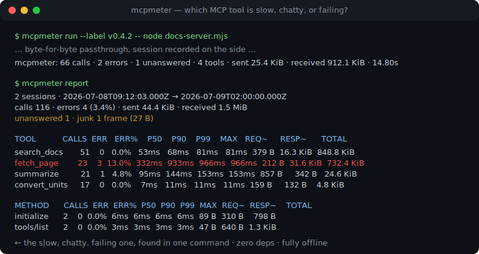
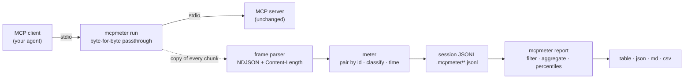

# mcpmeter

[English](README.md) | [中文](README.zh.md) | [日本語](README.ja.md)

[](LICENSE)  [](CHANGELOG.md)  [](CONTRIBUTING.md)

**MCP 用量计量器 —— 一个直通式 stdio 代理，记录每个工具的延迟、载荷大小与错误率，并把整段会话聚合成分析报告。零运行时依赖。**



```bash
# not yet on npm — install from a checkout of this repository
npm install && npm run build && npm pack
npm install -g ./mcpmeter-0.1.0.tgz
```

## 为什么选 mcpmeter？

你的 Agent 越来越慢，却没人说得清是哪个 MCP 工具拖的后腿。客户端只有一个转圈的加载图标，服务器日志什么都没写，而 stdio 上的 JSON-RPC 对话完全不可见。现有的观测手段回答的都是别的问题：帧美化打印器让你看到*一次会话滚屏而过*——调一个坏掉的握手很好用，但答不了"这周是哪个工具吃掉了我们的延迟预算"；网关附带你并不需要的策略与鉴权；APM 全家桶要求在服务器里塞 SDK，而那份代码你往往改不了。mcpmeter 是中间那件朴素的仪表：只需在客户端配置里给服务器命令前面加一个词，每次会话就会安静地积累成一个只含元数据的 JSONL 文件——方法名、工具名、单调时钟上的延迟、线上字节数、结果分类；绝不落盘你的载荷。然后 `mcpmeter report` 把任意多个会话折叠成按工具的百分位延迟、错误率与流量汇总，还能按时间、标签或工具过滤。它不是调试器也不是网关：一个字节都不改写，给出的答案是一张表，而不是一段滚屏。

| | mcpmeter | 帧美化打印器 | MCP 网关 | APM / 追踪 SDK |
|---|---|---|---|---|
| 核心输出 | 跨会话的按工具聚合统计 | 逐帧实时打印 | 审计 / 策略日志 | 后端里的 trace |
| 能答"哪个工具慢/话多/老出错？" | 能 —— 每个工具的 p50/p90/p99、字节数、错误率 | 只能靠翻滚屏 | 不能 —— 目标不同 | 插桩之后可以 |
| 接入成本 | 在服务器命令前加 `mcpmeter run --` | 前置一个命令 | 部署服务并改客户端路由 | 修改服务器代码 |
| 线上保真度 | 逐字节直通，只读 | 通常直通 | 终结请求后重新发起 | 不适用 |
| 是否存储请求/响应载荷 | 从不 —— 设计上只存元数据 | 会打印出来 | 常存进审计日志 | 可配置 |
| 离线可用 / 零基础设施 | 是 —— 磁盘上的 JSONL 文件 | 是 | 需要网关常驻 | 需要 collector/后端 |
| 运行时依赖 | 0（只要 Node.js） | 不一 | 一个服务 | SDK + agent |

<sub>对比基于各工具类别 2026-07 时的公开文档。若你需要 RBAC 或载荷审计，请上网关 —— mcpmeter 只负责测量，不负责管制。</sub>

## 特性

- **构造上即隐形** —— stdin、stdout、stderr 与退出码逐字节直通；计量走的是每个数据块的*副本*，因此解析炸弹或超大帧永远无法篡改、延迟或打乱真实流量。
- **按工具的分析，而非帧转储** —— `mcpmeter report` 把每次记录的会话聚合成调用次数、错误率（`isError` 与 JSON-RPC error 分开计数）、最近秩 p50/p90/p99/max 延迟，以及每个工具、每个方法的平均/最大/总线上字节数。
- **整段会话全都入账** —— 通知、协议流上的垃圾字节、被取消的调用、无应答的请求、无主响应和重复 id 全部计数，报告因此也能回答"这台服务器*错没错*"，而不只是"慢不慢"。
- **跨会话的工作流** —— 用 `--label v0.4.2` 给运行打标签，再按标签、时间窗、最近 N 次会话或单个工具过滤报告；用几个纯文件就能把金丝雀版本和昨天的基线摆在一起比。
- **四种输出格式** —— 对齐的终端表格、给脚本的 JSON、贴进 PR 描述的 Markdown、进电子表格的 CSV；相同输入渲染出逐字节相同的输出。
- **只存元数据，完全离线** —— 参数与结果从不写盘；会话是本地可 grep 的 JSONL。不开任何 socket，不存在任何遥测，`typescript` 是唯一的 devDependency。

## 快速上手

先计量随附的演示服务器（一个文档助手：一个快工具、一个慢工具、一个不稳定工具），录下一次会话：

```bash
mcpmeter run --dir .mcpmeter --session-id demo --label demo -- node examples/demo-server.mjs \
  < examples/requests.ndjson > /dev/null
```

```text
mcpmeter: 9 calls · 1 error · 0 unanswered · 3 tools · sent 977 B · received 54.5 KiB · 149ms
mcpmeter: session "demo" → .mcpmeter/demo.jsonl (view: mcpmeter report --dir .mcpmeter)
```

再聚合 `examples/` 里预先录好的两段会话 —— 真实捕获的运行结果：

```bash
mcpmeter report --dir examples/sample-sessions
```

```text
2 sessions · 2026-07-08T09:12:03.000Z → 2026-07-09T02:00:00.000Z
calls 116 · errors 4 (3.4%) · sent 44.4 KiB · received 1.5 MiB
unanswered 1 · junk 1 frame (27 B)

TOOL           CALLS  ERR   ERR%    P50    P90    P99    MAX   REQ~     RESP~      TOTAL
search_docs       51    0   0.0%   53ms   68ms   81ms   81ms  379 B  16.3 KiB  848.8 KiB
fetch_page        23    3  13.0%  332ms  933ms  966ms  966ms  212 B  31.6 KiB  732.4 KiB
summarize         21    1   4.8%   95ms  144ms  153ms  153ms  857 B     342 B   24.6 KiB
convert_units     17    0   0.0%    7ms   11ms   11ms   11ms  159 B     132 B    4.8 KiB

METHOD      CALLS  ERR  ERR%  P50  P90  P99  MAX  REQ~  RESP~    TOTAL
initialize      2    0  0.0%  6ms  6ms  6ms  6ms  89 B  310 B    798 B
tools/list      2    0  0.0%  3ms  3ms  3ms  3ms  47 B  640 B  1.3 KiB
```

`fetch_page` 就是那个又慢、又话多、还老出错的工具 —— 一条命令找到。

## 接入你的客户端

在 MCP 客户端配置里把服务器命令包一层即可；两侧其他一切照旧：

```json
{
  "mcpServers": {
    "docs": {
      "command": "mcpmeter",
      "args": ["run", "--dir", "/home/dev/.mcpmeter", "--label", "docs-v2", "--",
               "node", "/srv/docs-server/index.js"]
    }
  }
}
```

客户端打开的每次对话都会变成一个会话文件。mcpmeter 支持实际环境中出现的两种 stdio 分帧（MCP 规范的按行 JSON，以及 LSP 风格的 `Content-Length` 头），按消息自动识别。0.1.0 尚不计量 HTTP 传输，代理也尚未与所有 MCP 客户端做过集成测试 —— 参考 SDK 的 stdio 是经过验证的路径。

## mcpmeter CLI

| 命令 | 作用 | 退出码 |
|---|---|---|
| `run [opts] -- <cmd...>` | 拉起服务器、直通 stdio、记录一次会话（`--dir`、`--session-id`、`--label`、`--max-frame`、`--quiet`） | 服务器自己的退出码；127 无法拉起；2 用法错误 |
| `report [opts]` | 聚合会话（`--format table\|json\|md\|csv`、`--sort`、`--top`、`--last`、`--since`、`--label`、`--tool`） | 0；1 没有会话；2 用法错误 |
| `sessions [opts]` | 列出已记录会话及各自计数（`--dir`、`--format table\|json`） | 0；1 没有会话；2 用法错误 |

## 读懂报告

| 列 | 含义 |
|---|---|
| `CALLS` / `ERR` / `ERR%` | 完成的请求/响应对；错误 = `tool_error`（`result.isError`）+ `rpc_error`（JSON-RPC `error`）；取消单独计数，不算错误 |
| `P50` `P90` `P99` `MAX` | 单调时钟上的最近秩延迟百分位 —— 报告里的每个值都是真实发生过的延迟，绝非插值 |
| `REQ~` / `RESP~` / `TOTAL` | 平均请求 / 平均响应 / 总线上字节数，含分帧开销 |
| `unanswered` | 会话结束时仍未得到响应的请求 —— 那个"一去不回的工具" |
| `junk` | 协议流上不是 JSON-RPC 的字节（漏出来的 `print`、超大帧）—— 原样放行，但记账 |

会话文件格式（每个事件一行 JSONL，只含元数据）见 [docs/session-format.md](docs/session-format.md)；随附示例的说明见 [examples/](examples/README.md)。

## 架构



## 路线图

- [x] 双分帧直通 stdio 代理、懂 MCP 的计量（工具错误、取消、无应答、协议异常）、JSONL 会话存储、四种格式带过滤与排序的跨会话报告、91 个离线测试 + 冒烟脚本（v0.1.0）
- [ ] 在同一会话格式下计量 Streamable-HTTP 传输
- [ ] `report --diff <labelA> <labelB>`，把两个服务器版本并排 A/B 对比
- [ ] 面向 CI 的预算闸门：`report --fail-if "p99>500ms" --fail-if "err%>2"`
- [ ] `mcpmeter top` —— 针对当前会话的实时刷新终端视图
- [ ] 可选的直方图导出（OpenMetrics 文本），供现有看板抓取

完整列表见 [open issues](https://github.com/JaydenCJ/mcpmeter/issues)。

## 参与贡献

欢迎贡献。先 `npm install && npm run build` 构建，然后跑 `npm test` 和 `bash scripts/smoke.sh`（必须打印 `SMOKE OK`）—— 本仓库不带任何 CI，上面的每个断言都靠本地运行验证。参见 [CONTRIBUTING.md](CONTRIBUTING.md)，认领一个 [good first issue](https://github.com/JaydenCJ/mcpmeter/issues?q=is%3Aissue+is%3Aopen+label%3A%22good+first+issue%22)，或发起一个 [discussion](https://github.com/JaydenCJ/mcpmeter/discussions)。

## 许可证

[MIT](LICENSE)
